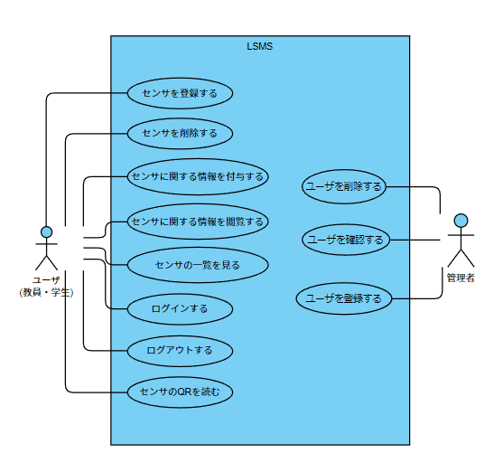

# LSMS　ユースケースモデリング

2023-06-26 チーム2

研究室内のセンサ管理システムのユースケースモデリングを行う．

## 1. ユースケース図

## 2. ユースケース一覧
### 2.1 ユーザ用ユースケース
1. [センサを登録する](usecase1.md)
1. [センサを削除する](usecase2.md)
1. [センサの状態を変更する](usecase3.md)
1. [センサに関する情報を閲覧する](usecase4.md)
1. [ログインする](usecase5.md)
1. [ログアウトする](usecase6.md)
1. [センサのQRコードを読み取る](usecase7.md)

### 2.2 管理者用ユースケース
1. [ユーザを登録する](usecase_k1.md)
1. [ユーザを削除する](usecase_k2.md)
1. [ユーザを確認する](usecase_k3.md)