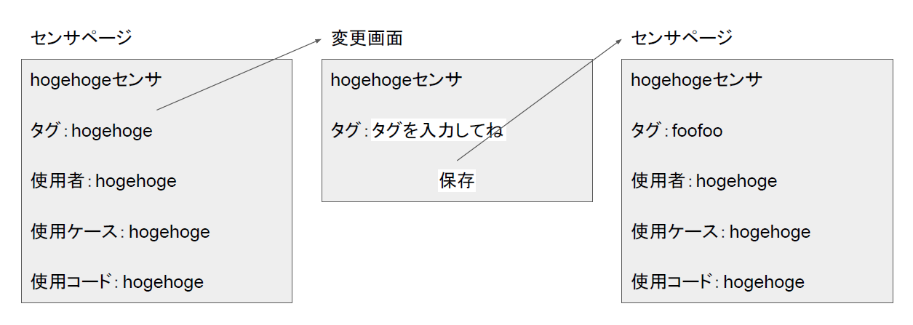

# ユースケース3：センサに関する情報を変更する

## 概要
- ユーザがセンサに関する情報を変更する
## アクタ
- ユーザ
## 事前条件
- センサが登録されていること
## 事後条件
- 当該センサの情報が変更される
## トリガー
- ユーザがセンサのQRコードを読み取る
## 基本フロー
1. ユーザはセンサのQRコードを読み取る
2. システムはログイン画面を表示する
3. 学生はログインする
4. システムはセンサのページを表示する
5. 学生は変更箇所を選択する
6. システムは変更内容を尋ねる
7. ユーザは変更内容を入力し，「保存」ボタンを押す
8. システムは変更後のセンサ情報を表示する
## 代替フロー
### 代替フロー1
- 1.a.1 1でQRコードがない場合，ユーザはメニューから「センサを検索」を選択する
- 1.a.2システムはタグの一覧を表示する
- 1.a.3 学生は情報を変更したいセンサのタグを選択する
- 1.a.4 システムはタグ付けされたセンサの一覧を表示する
- 1.a.5 ユーザは情報を変更したいセンサを選択する
- 1.a.6 以降，3に合流する  
