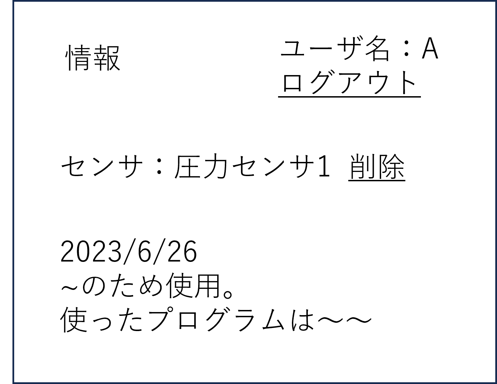

# ユースケース4： センサに関する情報を閲覧する

## 概要
使いたいセンサの情報を閲覧する

## アクター
* 学生
* 教員

## 事前条件
学生または教員がシステムにログインしていること。対象のセンサが登録されていること．

## 事後条件
対象のセンサの情報が表示される．

## トリガー
学生または教員が対象のセンサを検索し選択する．

## 基本フロー
1.学生または教員は、対象のセンサを検索する．　　
2.システムは対象のセンサ情報を表示する．  

## 代替フロー
### 代替フロー1
2a.対象のセンサがない場合，表示エラーを表示し，1に戻る

## GUI紙芝居
### 削除画面
