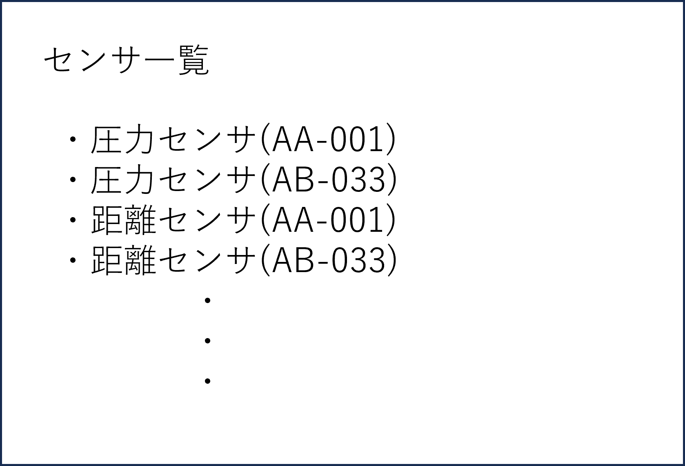

# ユースケース5： センサの一覧を見る

## 概要
登録されているセンサの一覧を見る

## アクター
* 学生
* 教員

## 事前条件
学生または教員がシステムにログインしていること。センサが登録されていること．

## 事後条件
登録されているのセンサの一覧が表示される．

## トリガー
学生または教員がセンサ一覧表示ボタンを選択する．

## 基本フロー
1.システムは、メニュー画面を表示する．
2.学生または教員は、センサ一覧を選択する．　　
3.システムは対象のセンサ情報を表示する．  

## 代替フロー
### 代替フロー1
2a.センサが一つも登録されていない場合，表示エラーを表示し，1に戻る

## GUI紙芝居
### 削除画面
