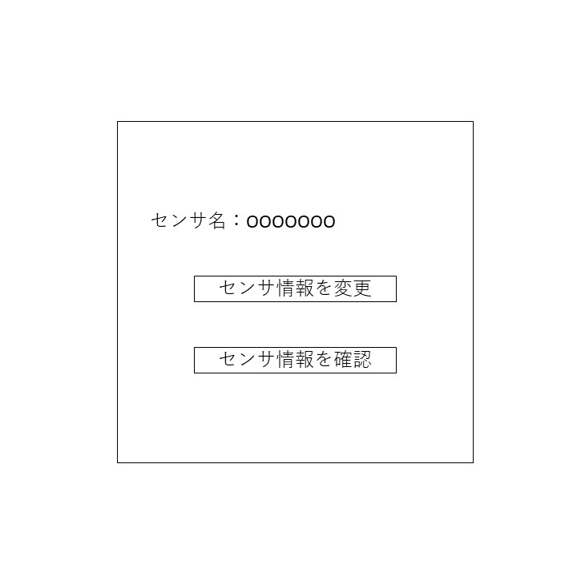

# ユースケース 8： センサのQRコードを読み取る

## 概要
教員・学生がセンサに付いたQRコードを読み取り、センサ情報を取得or変更する。

## アクター
- 教員・学生

## 事前条件
- システムにログインしていること。目当てのセンサがシステムに登録されていること。

## 事後条件
- センサ情報が閲覧、変更可能になる。(ユースケース3)

## トリガ―
- 教員・学生がメニューから「QRコードの読み取り」を選択する。

## 基本フロー
1. 教員・学生は，メニューから「QRコードの読み取り」のボタンを押す
2. システムは，QRコードを読み取るカメラを起動する。
3. 教員・学生は，目当てのセンサに付いたのQRコードを読み取る。
4. システムは，読み取ったコードに紐づけられたセンサの
「情報変更」、「情報表示」の両方のボタンを表示。
5. 教員・学生は，「情報表示」、「情報変更」のいずれかのボタンを選択。(ユースケース3)or(ユースケース4)へ

## 代替フロー
### 代替フロー1
- 3a.1  基本フロー3でQRコードに対応したセンサが存在しない場合，システムは読み取りエラーを出し，1に戻る．

## GUI紙芝居
### Q「情報変更」、「情報表示」のボタンを表示画面

