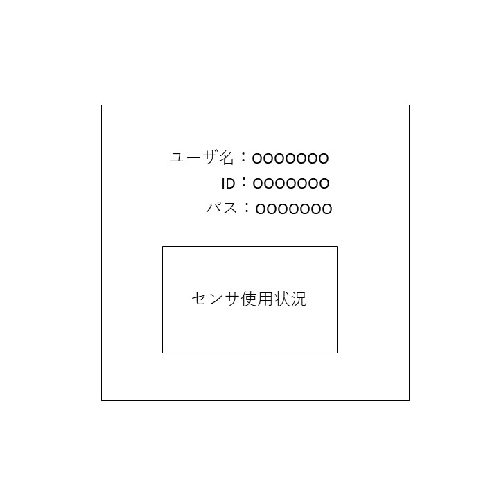

# ユースケース k3： 管理者がユーザを確認する。

## 概要
管理者がユーザ情報を取得する．

## アクター
- 管理者

## 事前条件
- システムにログインしていること。ユーザがシステムに登録されていること。

## 事後条件
- ユーザ情報情報が閲覧可能になる。

## トリガ―
- 管理者がシステムにログインする。

## 基本フロー
1. 管理者は，ユーザ情報の確認ボタンを選択
2. システムは，ユーザ一覧を表示する。
3. 管理者は，目当てのユーザを選択
4. システムは，ユーザ情報を表示。

## GUI紙芝居
### Q「情報変更」、「情報表示」のボタンを表示画面

