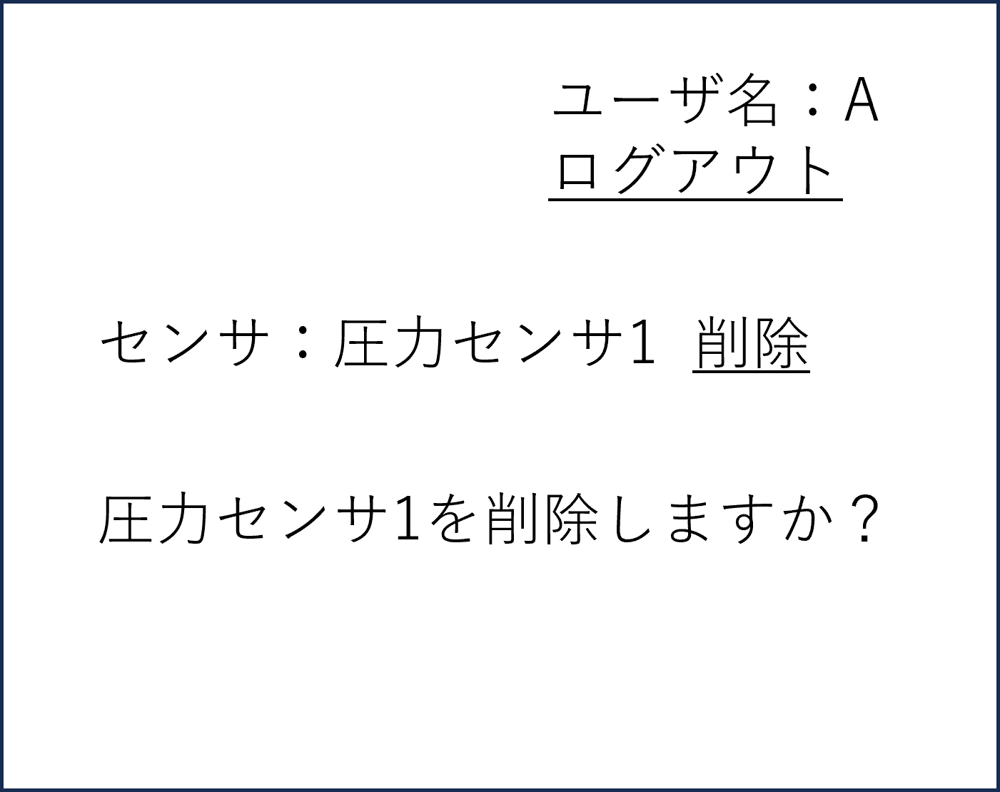

# ユースケース2： センサを削除する

## 概要
誤って登録したセンサを削除する

## アクター
* 学生
* 教員

## 事前条件
学生または教員がシステムにログインしていること。対象のセンサが登録されていること．

## 事後条件
対象のセンサの登録が削除される．

## トリガー
学生または教員が「削除」のメニューを選択する．

## 基本フロー
1.学生または教員は、対象のセンサを検索する．　　
2.システムは対象のセンサ情報を表示する．  
3.学生または教員は，削除ボタンを押す．
4.システムは削除完了を表示しメニューに戻る．

## 代替フロー
### 代替フロー1
2a.対象のセンサがない場合，表示エラーを表示し，1に戻る

## GUI紙芝居
### 削除画面
