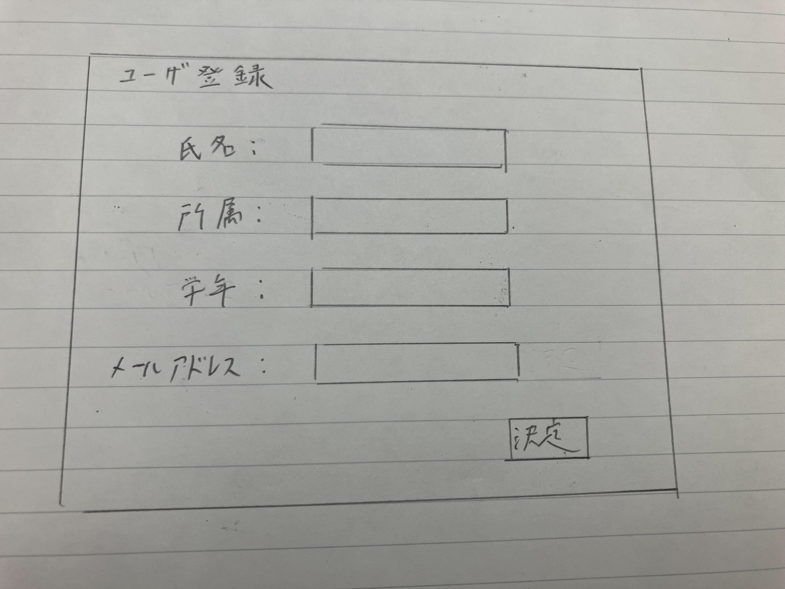

# ユースケース1: ユーザを登録する

## 概要
管理者が新しくユーザと認めた者のログインIDとパスワードを発行し，ユーザとして登録する．

## アクター
* 管理者

## 事前条件
* 管理者用のログインを行っていること

## 事後条件
* 新規ユーザのログインIDとパスワードが発行できていること
* 新規ユーザがユーザとして登録されていること

## トリガー
* 管理者がシステムの「新規ユーザ登録」を押す．

## 基本フロー
1. 管理者は，システムの「新規ユーザ登録」を押す．
2. システムは，ユーザ登録画面を表示する．
3. 管理者は，新規ユーザの氏名，所属，学年，メールアドレスを入力する．
4. システムは，新規ユーザのログインIDとパスワードを自動生成する．
5. システムは，記入されたメールアドレスにログインIDとパスワードを送付する．
6. システムは，システムのマイページに戻る．

## 代替フロー
### 代替フロー1
* 3.a.1  氏名，所属，メールアドレスが記入されていない場合，エラーを出して，再度3に戻る．

## GUI紙芝居
### ユーザ登録画面
