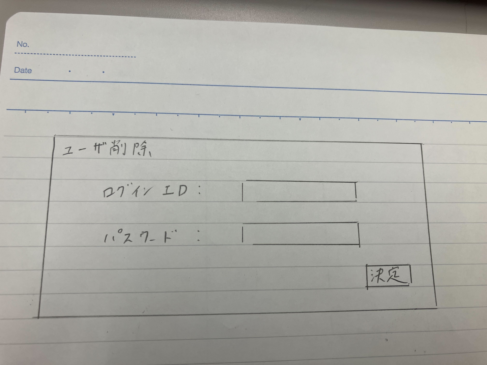

# ユースケース2: ユーザを削除する

## 概要
管理者が削除したいユーザをシステムから削除する．

## アクター
* 管理者

## 事前条件
* 管理者用のログインを行っていること
* 削除されるユーザが存在していること

## 事後条件
* 削除されるユーザのログインIDとパスワードが無効化できていること
* 削除されるユーザがユーザとして登録されていること

## トリガー
* 管理者がシステムの「ユーザ削除」を押す．

## 基本フロー
1. 管理者は，システムの「ユーザ削除」を押す．
2. システムは，ユーザ削除画面を表示する．
3. 管理者は，削除するユーザのログインIDとパスワードを入力する．
4. システムは，入力されたユーザのログインIDとパスワードを無効化する．
5. システムは，マイページに戻る．

## 代替フロー
### 代替フロー1
* 3.a.1  ログインIDとパスワードが記入されていない場合，もしくはログインIDとパスワードが登録されたものと合致しない場合，エラーを出して，再度3に戻る．

## GUI紙芝居
### ユーザ削除画面
