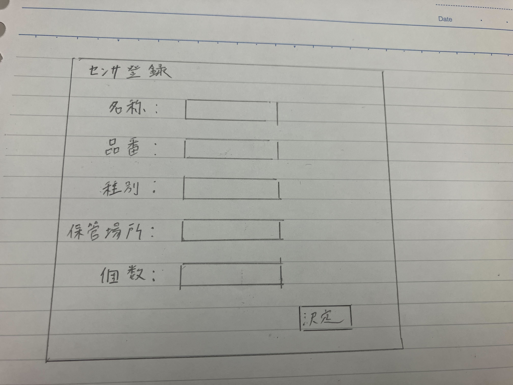

# ユースケース1: センサを登録する

## 概要
教員や学生が新しく入手したセンサをシステムに登録し，他のユーザも閲覧できるようにする．

## アクター
* ユーザ(教員・学生)

## 事前条件
* システムにログインしていること

## 事後条件
* センサがシステムに登録されていること
* センサに紐づけられたQRコードが発行できていること

## トリガー
* ユーザがシステムのマイページの「センサ登録」を押す．

## 基本フロー
1. ユーザは，システムの「センサ登録」を押す．
2. システムは，センサ登録画面を表示する．
3. ユーザは，センサの名称，品番，種別，使用者，保管場所，個数を入力する．
4. システムは，マイページに戻る

## 代替フロー
### 代替フロー1
* 3.a.1  名称，品番，種別，保管場所，個数が記入されていない場合，エラーを出して，再度3に戻る．

## GUI紙芝居
### センサ登録画面

